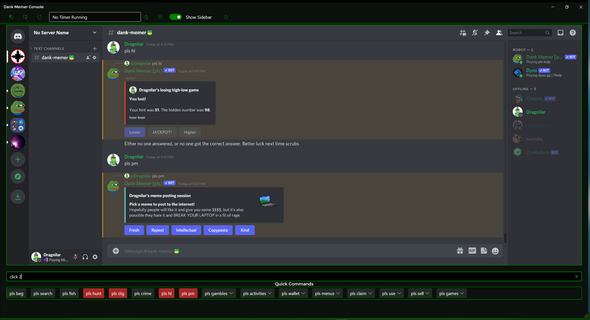
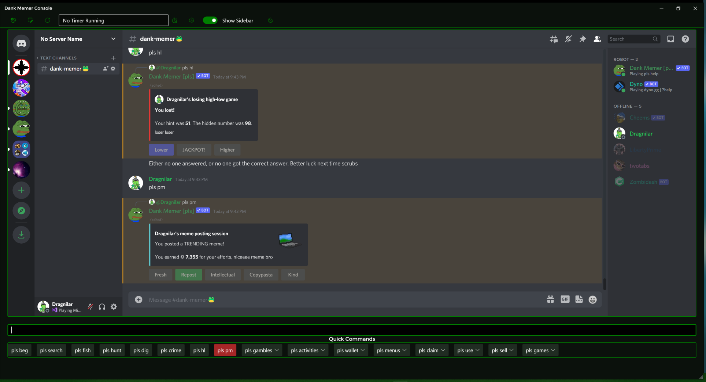
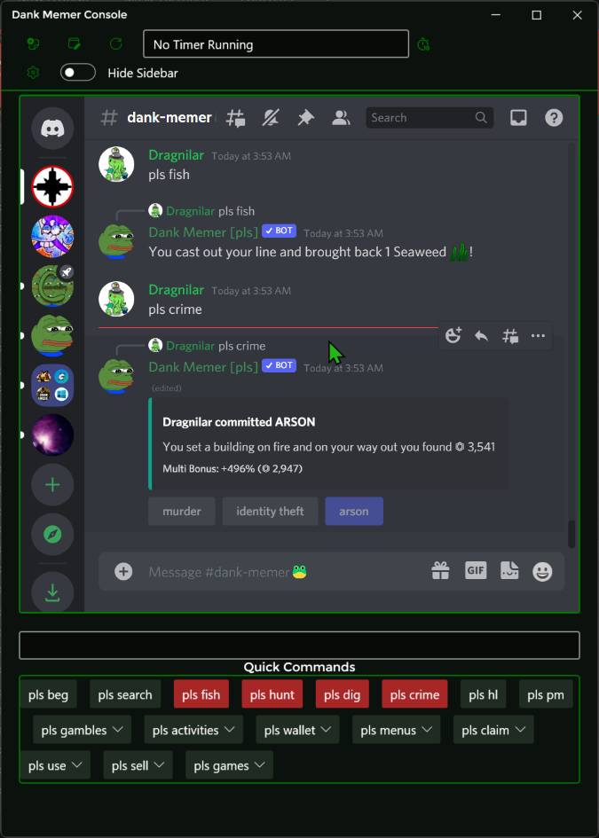

# DankMemerConsole

This is a windows application for playing Dank Memer on Discord. It provides a number of convienences for playing Dank Memer as well as the standard Discord webpage. This app was made for fun in my spare time and also primarily to test out WebView2 (the embedded Edge Browser). This app demonstrates some of the things you can do with WebView2, including JavaScript interop, using keyboard emulation, modifying the DOM/web page and treating the website as part of your application (Hybrid App, basically). 

## Features

- Play Dank Memer (mostly) with either just your mouse or keyboard. No more having to switch back and forth constantly!

- Cooldown timers / alerts for the standard "grind" commands in Dank Memer.

- Stopwatch timer for helping you keep track of long runing waits like pls work, pls stream, etc.

- Configurable gambling, lottery, withdraw amounts.

- Hot keys for switching back and forth between the main app and the embedded Edge / WebView2 page that shows Discord.

- Option to show/hide the channel list / side-bar in Discord.

- Lighter on memory (mostly) than the regular Discord Windows client thanks to WPF + WebView 2 instead of Electron.

## Screenshots

Example of using the click command:

App window at smallest size with the sidebar and member lists in Discord hidden:

## Usage

1) Download the program and open it up. The app will generate a cache for its embedded Edge browser, a folder for its settings file and a folder for its log file in the same folder. You should probably put it somewhere that isn't clamped down with security (I.E. Your documents folder is a good place).

2) Enter your Discord Username and Password

3) Click the login to discord button

4) When you are logged into Discord and on your account, go to the channel you normally use for playing Dank Memer.

5) Click the script inject button (necessary) and also click the channel register button so the app remembers which channel to go to the next time you open it.

6) Start playing Dank Memer either using the buttons under the quick commands section or use the text box to enter commands.

7) IF you are using the keyboard method with the text box, you can click buttons that the bot shows using the "click" command. To click a button other than the first one, enter click 2, 3, 4, etc.

  a) Note that if you enter just "click", the program will attempt to click the first button in the most recent message in the current Discord channel.
  b) If you enter "click 0 or click 1", you will be esentially doing the same as what is noted in a).
  c) If you enter click with a button number that doesn't exist in a message (I.E. click 591925 3), the app will click the last available button.

8) If a button is not in the first message at the bottom of the message list, you need to enter the index of the message starting from the bottom (I.E. If the message is the second one up from the bottom in the chat, to click the first button in it, enter Click 1 2).

9) When you use one of the "grind" commands for Dank Memer, you'll see the button for it light up red, indicating it is on cooldown. Once the cooldown expires, it will return to its normal state, indicating the cooldown has ended.

## Hot Keys

- **CTRL+T** = Focus the text box in the app
- **CTRL+K** = Focus Discord / WebView2
- **CTRL+M** = Start/Stop the timer
- **CTRL+I** = Inject scripts (useful after doing a refresh)

## Hot Keys For Discord / WebView 2

- All standard Discord Webpage Hot Keys *should* work
- **F5** to refresh web page
- **F12** to open browser debugger

## Note On Cooldowns

- The cooldowns are currently using values that which assume you are a patreon subscriber for Dank Memer. If you are not a subscriber, I strongly encourage you to subscribe if you are interested in supporting Dank Memer's own development. 

- I will implement a way to toggle between the non-sub and sub cooldown values soon.

## Known Issues / Limitations
- The app uses keyboard emulation with the Windows OS to enter messages into Discord. Sometimes Windows moves faster than the app and you can end up with incomplete messages or other odd bugs. This is fairly easy to work around by clicking on Discord and then back in the rest of the app or clearing the message box in Discord and trying again. This is also amplified by the fact that the app uses WebView2 to display Discord inside of it. Microsoft is supposedly working on better keyboard integration with WebView 2, so this may be better resolved in the future.
  - If you run into the above problem, you should also go into the settings menu and adjust the delay for the virtual keyboard. Setting it higher will cause a longer delay (for slower computers) or making it lower will decrease the delay (for faster computers). Please note that setting the value too low can potentially cause strange behavior and setting it too high will cause significant input lag.

- The cooldown tracking for the app is not perfect since Dank Memer can lag in responses and/or other occurences. 

- Slash commands are buggy and are not officially supported. You can try using them, but due to the fact that Discord has a slight delay when a slash is entered and before it knows you're using a slash command, a lot of times you'll end up sending a message or getting Discord giving you its "error" shake.
  - Note: I do plan on adding support for slash commands *IF* Dank Memer switches over to using them in the coming months for the **pls** commands.

- Sometimes the script injector button doesn't inject scripts properly when you use it to log into Discord. This is more or less a timing issue with the browser page loading and there really isn't much I can think of to work around it at the moment. The best thing I can suggest is just click the button again if you notice the click commands or the hide sidebar button not working.

- Currently you can only clear the cache for WebView2 by either using the browser debugger or deleting the cache folder that gets made in the directory where you run the program.

- I have not tested this app on any OS besides Windows 10/11. It SHOULD work on Windows 7 but I cannot guarantee it. 
   - And no, I will not be making a version for Linux or Mac. 

- Switching between Discord and the text box via CTRL+T / CTRL+K can sometimes result in focus problems. 
    - For Discord, I have found hitting tab afterwards should put your cursor in the element that should be focused. Hitting CTRL+T a second time should focus the text box for the app if it doesn't focus the first time you hit CTRL+T.

- While this program works surprisingly well, in my opinion, as an alternative to the Discord client for Windows, you should be aware that WebView2 has built in limitations versus the full Edge browser. To read up on said limitations, please see the [documentation on the differences between Edge and WebView2 here](https://docs.microsoft.com/en-us/microsoft-edge/webview2/concepts/browser-features).

## Techologies / Libraries Used

- [WPF (Dot Net 6) for the Windows Application itself](https://docs.microsoft.com/en-us/dotnet/desktop/wpf/overview/?view=netdesktop-6.0)

- [DevExpress' MVVM Framework for MVVM architecture and code simplification](https://github.com/DevExpress/DevExpress.Mvvm.Free)

- [Ghost1372's Unofficial ModernWPF Library](https://github.com/ghost1372/ModernWpf)

- [WebView2 for the embedded Edge Browser](https://developer.microsoft.com/en-us/microsoft-edge/webview2/)

- [JQuery for helping with JavaScript interop](https://github.com/jquery/jquery)

- [Tyrrrz.Settings](https://github.com/Tyrrrz/Settings)

- [Nlog for logging](https://github.com/nlog/NLog/)
  
- [Fluent System Icons For WPF](https://www.nuget.org/packages/FluentSystemIconsForWPF/)

- [Montserrat Font, the font Dank Memer's website uses](https://fonts.adobe.com/fonts/montserrat)

- IDE: [Visual Studio 2022](https://visualstudio.microsoft.com/) w/ [ReSharper](https://www.jetbrains.com/resharper/). 

## Privacy Policy

- This app does not explicitly collect any personal information from you or send it anywhere. 

- Please note that Microsoft may collect telemetry and/or diagnostic information from Edge. You should review their privacy policies if you have questions about them.

- Discord may collect information as well and you should obviously use your best judgement when chatting with people on Discord.

## FAQ / Liabilities / Etc

### Is this affiliated with Dank Memer's Developers?

- No it is not and I am not sure of what Dank Memer's developers (I.E. Melmsey) think of using apps like this one. I have inquired but I have never received any response.

### If the Dank Memer devs do not like this program, will you take down this repo?

- Yes. If word gets back to them and they ultimately decide that people should only play Dank using the basic Discord setup, then I'll take down this repo.

### Does this violate Dank Memer's TOS?

- I do not know and as you can see from the above, if the developers do not approve of it, I will honor their wishes.

### Can I get banned from Discord for using this?

- Again, I do not know. However if you are concerned, be cautious and don't use the program. Please note that I cannot be held responsible for what happens to you on Discord, as you probably are already aware.

